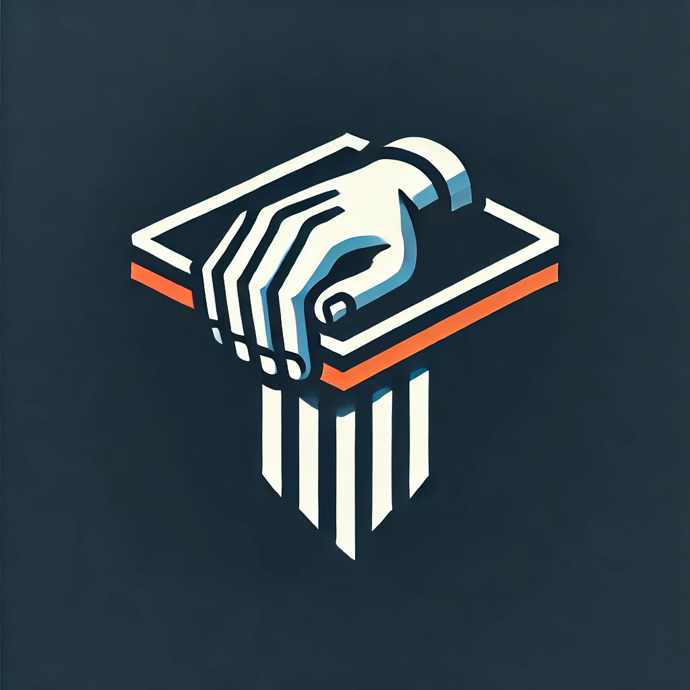
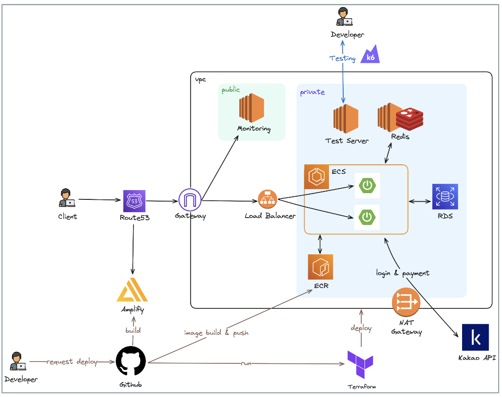

    

<h1 align="middle">GrabTable</h1>

당신의 귀한 시간을 위한 식당 공유주문 및 예약 서비스, GrabTable

## 프로젝트 소개

사용자는 음식 선택, 주문, 결제, 예약을 모두 GrabTable에서 진행할 수 있습니다!

예약 생성 시 초대 코드가 발급되며, 해당 코드를 통해 다른 사용자를 예약에 초대하고 함께 주문할 수 있습니다.

## 프로젝트 아키텍처

    

## 프로젝트 기술 스택

    

## 팀원

|                              Backend & Frontend                               |                                Backend & Infra                                |                                    Frontend                                    |                               Frontend & Infra                                |
| :---------------------------------------------------------------------------: | :---------------------------------------------------------------------------: | :----------------------------------------------------------------------------: | :---------------------------------------------------------------------------: |
|  |  |  |  |
|                       [영섭](https://github.com/000sub)                       |                      [찬영](https://github.com/jcy0308)                       |                       [형진](https://github.com/gitFILO)                       |                       [성현](https://github.com/goo314)                       |
