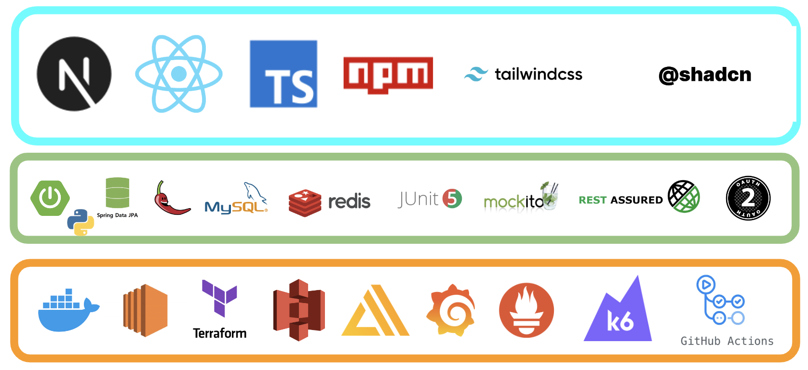
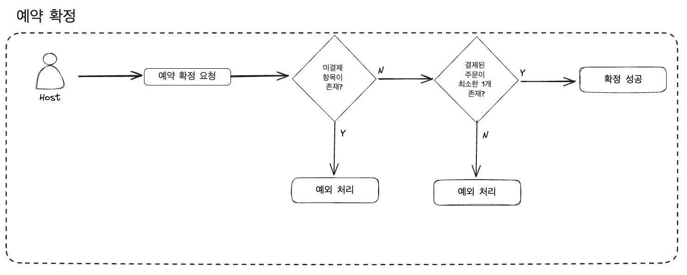
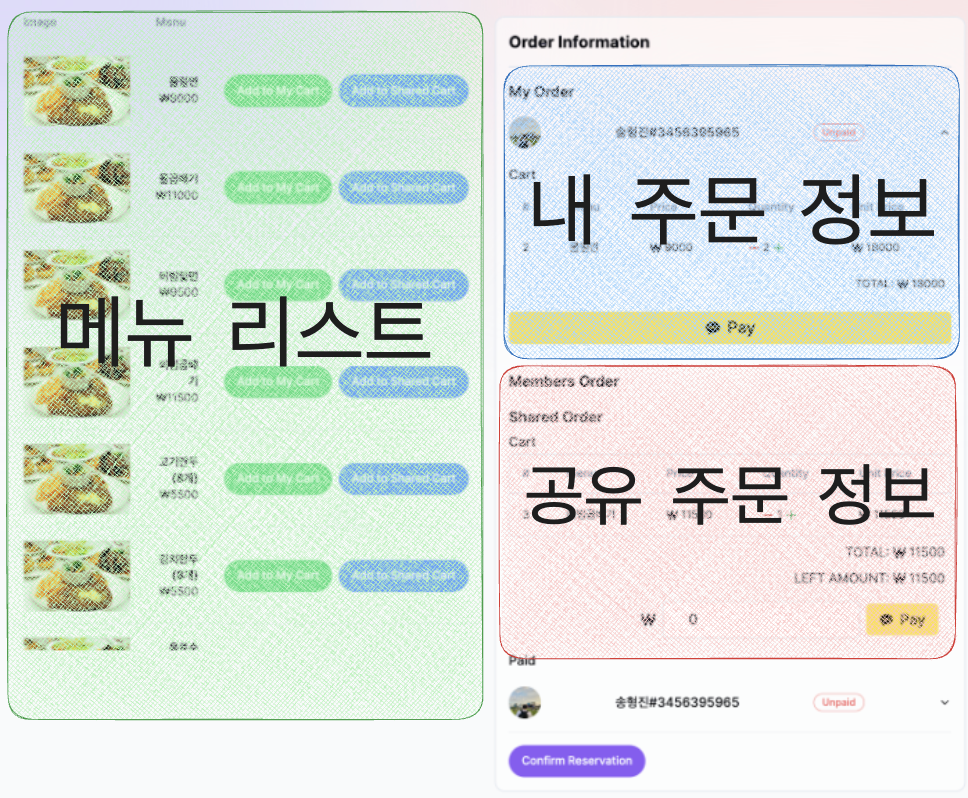

    

<h1 align="middle">GrabTable</h1>

당신의 귀한 시간을 위한 식당 공유주문 및 예약 서비스, GrabTable

## 프로젝트 소개

사용자는 음식 선택, 주문, 결제, 예약을 모두 GrabTable에서 진행할 수 있습니다!

예약 생성 시 초대 코드가 발급되며, 해당 코드를 통해 다른 사용자를 예약에 초대하고 함께 주문할 수 있습니다.

## 프로젝트 아키텍처

    

## 프로젝트 기술 스택

    

## 유저 시나리오

### 1. 예약 생성

    

### 2. 예약 참여

    

### 3. 개인 장바구니 변경

    

### 4. 공유 장바구니 변경

    

### 5. 예약 확정

    

## 주요 기능

### 1. 예약 갱신 시 참여자 간 정보 최신화

    

    

자신뿐만 아니라, 예약 내 다른 사용자의 장바구니 및 결제 여부도 실시간으로 확인할 수 있어야 합니다.  

변경 발생 시에만 Server Sent Event를 전송하는 구조를 채택해 기존 폴링 방식에 비해 서버 부하를 최소화했습니다.  

성능에 강점이 있고 이벤트 브로드캐스팅에 유리한 Redis pubsub 메시지 큐를 활용해 분산 WAS 환경에서 이벤트가 누락되는 문제를 해결했습니다.

### 2. PG 연동 결제 흐름

    

